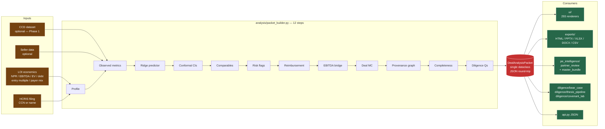
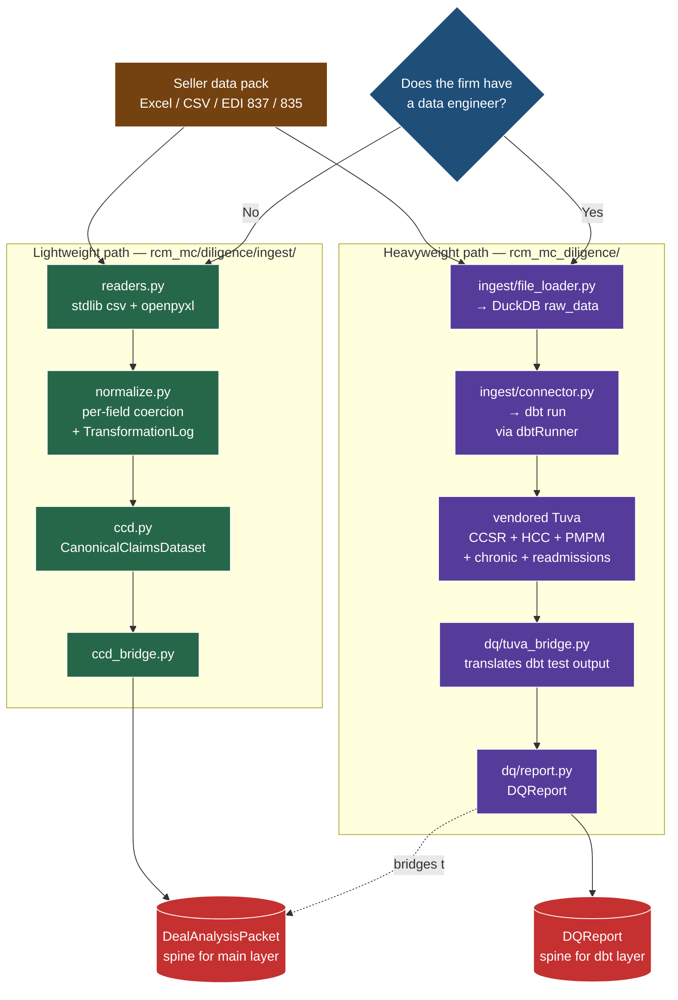
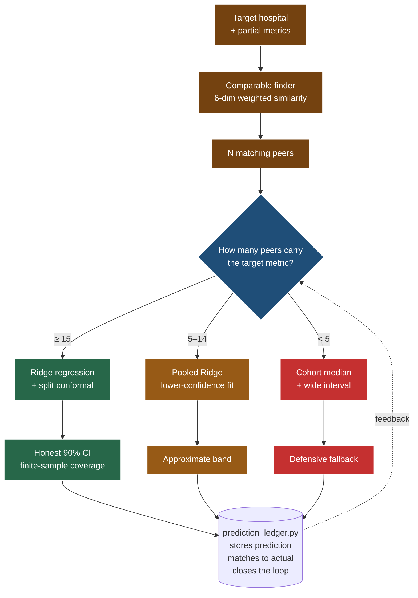
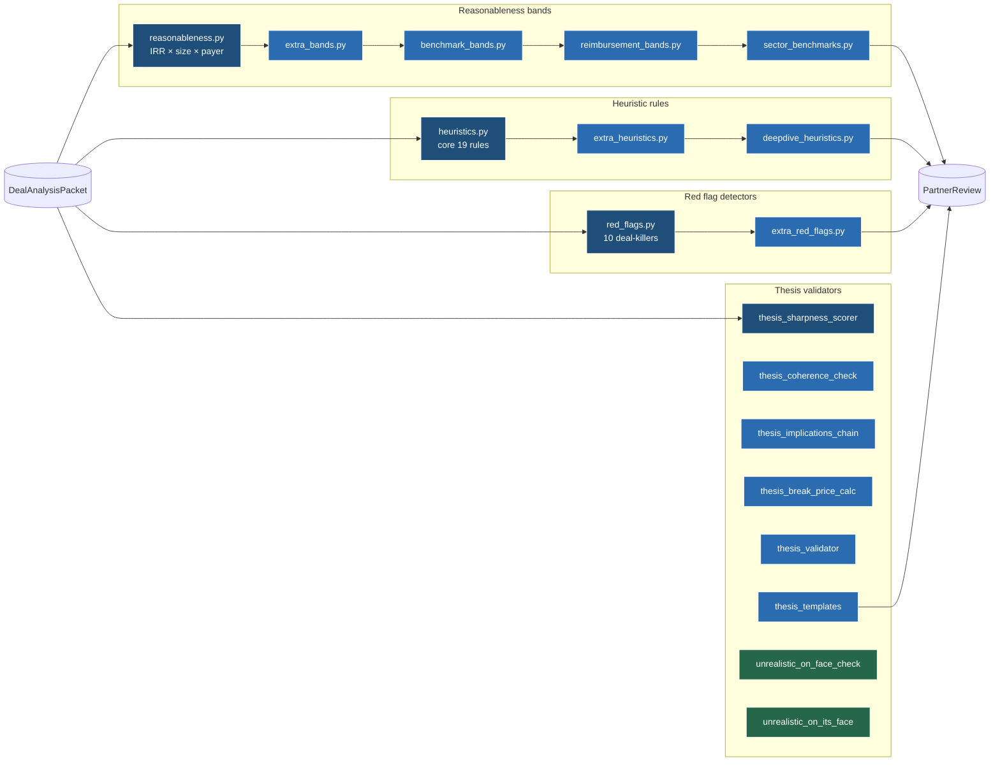
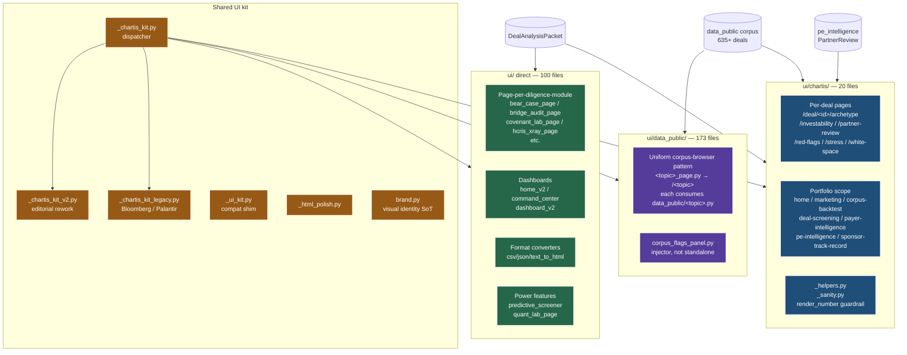

# Architecture Map — SeekingChartis / RCM-MC

**Text-based architecture visualizations using GitHub-native Mermaid.** No build step, no HTML, no external dependencies — this file renders as diagrams when viewed on GitHub. Edit as text, diff cleanly in git.

Eight diagrams capturing the load-bearing architectural decisions. Paired with [FILE_MAP.md](FILE_MAP.md) (1,659-file catalogue) and the per-package READMEs.

---

## 1. Top-level package dependency graph

The 29 sub-packages under `rcm_mc/` group into five tiers. Arrows = import dependencies.

```mermaid
flowchart TD
    classDef entry fill:#1F4E78,stroke:#fff,color:#fff
    classDef math fill:#2b6cb0,stroke:#fff,color:#fff
    classDef analytics fill:#2c5282,stroke:#fff,color:#fff
    classDef dataL fill:#553c9a,stroke:#fff,color:#fff
    classDef ui fill:#276749,stroke:#fff,color:#fff
    classDef infra fill:#744210,stroke:#fff,color:#fff
    classDef ops fill:#975a16,stroke:#fff,color:#fff

    CLI[cli / pe_cli / portfolio_cmd]:::entry
    SERVER[server.py<br/>HTTP app]:::entry
    API[api.py<br/>programmatic]:::entry

    subgraph math ["Math layer"]
        CORE[core/<br/>simulator + RNG + calibration]:::math
        MC[mc/<br/>two-source MC]:::math
        PE[pe/<br/>bridge + MOIC + IRR]:::math
        RCM[rcm/<br/>claims + initiatives]:::math
        FINANCE[finance/<br/>DCF + LBO + reimbursement]:::math
        SCENARIOS[scenarios/<br/>builder + shocks]:::math
    end

    subgraph analytic ["Analytics layer"]
        ANALYSIS[analysis/<br/>DealAnalysisPacket<br/>+ packet_builder]:::analytics
        ML[ml/<br/>ridge + conformal + clustering]:::analytics
        DILIGENCE[diligence/<br/>35 sub-modules]:::analytics
        PE_INTEL[pe_intelligence/<br/>276 partner-brain modules]:::analytics
        ANALYTICS_PKG[analytics/<br/>causal + counterfactual]:::analytics
        DATA_PUBLIC[data_public/<br/>313 corpus engines<br/>+ 104 seed files]:::analytics
        PROV[provenance/<br/>DataPoint + graph]:::analytics
        DOMAIN[domain/<br/>econ ontology]:::analytics
        INTEL[intelligence/<br/>Seeking Alpha composite]:::analytics
        MKT_INTEL[market_intel/<br/>public comps + PE deals]:::analytics
        VERTICALS[verticals/<br/>ASC / MSO / BH]:::analytics
    end

    subgraph dataLayer ["Data layer"]
        DATA[data/<br/>HCRIS + Care Compare<br/>+ IRS 990 + SEC EDGAR]:::dataL
        INGEST[diligence/ingest/<br/>Phase 1 CCD contract]:::dataL
        DILIGENCE2[rcm_mc_diligence/<br/>dbt + DuckDB + Tuva<br/>heavyweight path]:::dataL
    end

    subgraph infraLayer ["Infrastructure"]
        INFRA[infra/<br/>config + logger + jobs<br/>+ backups + webhooks]:::infra
        AUTH[auth/<br/>scrypt + sessions + RBAC]:::infra
        COMPLIANCE[compliance/<br/>PHI + hash-chain]:::infra
        ENGAGE[engagement/<br/>per-engagement RBAC]:::infra
        INTEG[integrations/<br/>CRM + vendor sockets]:::infra
        AI[ai/<br/>LLM + conversation]:::infra
    end

    subgraph opsLayer ["Operations"]
        DEALS[deals/<br/>lifecycle + notes<br/>+ approvals + health]:::ops
        PORTFOLIO[portfolio/<br/>store + dashboard + digest]:::ops
        ALERTS[alerts/<br/>fire + ack + age + escalate]:::ops
        REPORTS[reports/<br/>HTML + PPTX + markdown]:::ops
        EXPORTS[exports/<br/>packet_renderer<br/>+ IC packet + QoE]:::ops
        UI[ui/<br/>100 direct + 173 corpus<br/>+ 20 chartis = 293 pages]:::ui
    end

    CLI --> CORE
    CLI --> PE
    SERVER --> UI
    API --> CORE
    SERVER --> AUTH
    SERVER --> INFRA

    CORE --> MC
    MC --> PE
    PE --> ANALYSIS
    RCM --> PE
    FINANCE --> PE
    SCENARIOS --> MC

    DATA --> ANALYSIS
    INGEST --> ANALYSIS
    DILIGENCE2 -.alt ingestion.-> ANALYSIS

    ANALYSIS --> DILIGENCE
    ML --> ANALYSIS
    DILIGENCE --> PE_INTEL
    PE_INTEL --> REPORTS
    PE_INTEL --> EXPORTS
    ANALYTICS_PKG --> ANALYSIS
    PROV --> ANALYSIS
    DOMAIN --> PE
    DOMAIN --> ML

    DATA_PUBLIC --> PE_INTEL
    INTEL --> UI
    MKT_INTEL --> UI
    VERTICALS --> PE
    VERTICALS --> ANALYSIS

    DEALS --> PORTFOLIO
    PORTFOLIO --> ALERTS
    ANALYSIS --> DEALS
    EXPORTS --> REPORTS
```

**Read this**: the math layer (core/mc/pe/rcm/finance) feeds the analytics layer (analysis → diligence → pe_intelligence), which flows into operations (deals/portfolio/reports/exports) and renders through ui/. The data layer has two parallel ingestion paths. Infrastructure is a cross-cutting concern every layer touches.

---

## 2. Packet-centric data flow — the load-bearing invariant

Every UI page, API endpoint, and export renders from **one** `DealAnalysisPacket`. Nothing renders independently.

**Read this**: the packet is the spine. Every step in `packet_builder.py` can fail independently — failed sections are marked `INCOMPLETE` or `FAILED`; everything else still renders. Partners always see what succeeded. The parallel heavyweight layer (`rcm_mc_diligence/`) produces a `DQReport` that serves the same role for its pipeline.

---

## 3. The four canonical cross-module cascades

Core architectural insight of `pe_intelligence/`: senior partners reason **across** modules, not within them. Four named cascades represent the most common cross-module chains.

```mermaid
flowchart TD
    classDef trigger fill:#c53030,stroke:#fff,color:#fff
    classDef step fill:#975a16,stroke:#fff,color:#fff
    classDef outcome fill:#276749,stroke:#fff,color:#fff

    subgraph RCM ["1. RCM lever cascade"]
        R1[Denial rate<br/>change]:::trigger
        R2[Coding<br/>implications]:::step
        R3[CMI]:::step
        R4[NPSR]:::step
        R5[AR days]:::step
        R6[Cash<br/>generation]:::outcome
        R1 --> R2 --> R3 --> R4 --> R5 --> R6
    end

    subgraph Payer ["2. Payer-mix shift cascade"]
        P1[Medicaid →<br/>commercial claim]:::trigger
        P2[Rate change]:::step
        P3[Utilization]:::step
        P4[Denials]:::step
        P5[AR]:::step
        P6[MOIC<br/>impact]:::outcome
        P1 --> P2 --> P3 --> P4 --> P5 --> P6
    end

    subgraph Labor ["3. Labor shortage cascade"]
        L1[Nurse<br/>turnover]:::trigger
        L2[OT premium]:::step
        L3[Contract<br/>labor spend]:::step
        L4[Margin<br/>compression]:::step
        L5[Quality<br/>deterioration]:::step
        L6[Reimbursement<br/>cut]:::outcome
        L1 --> L2 --> L3 --> L4 --> L5 --> L6
    end

    subgraph Outpatient ["4. Outpatient migration cascade"]
        O1[Inpatient →<br/>outpatient]:::trigger
        O2[Volume mix]:::step
        O3[Payer<br/>blend shift]:::step
        O4[Capex<br/>reposition]:::step
        O5[Fixed-cost<br/>leverage loss]:::step
        O6[EBITDA<br/>compression]:::outcome
        O1 --> O2 --> O3 --> O4 --> O5 --> O6
    end

    META["Meta-engines reading across all 4:<br/>cross_module_connective_tissue<br/>connect_the_dots_packet_reader<br/>cross_pattern_digest"]

    RCM -.-> META
    Payer -.-> META
    Labor -.-> META
    Outpatient -.-> META
```

**Read this**: any one cascade is a known pattern partners have seen before. The **meta-engines** read ACROSS the cascades — "one trap is a negotiation; two traps on the same axis is a pass" (from `cross_pattern_digest.py`).

---

## 4. Two parallel ingestion paths

Not legacy vs current — these are **two deployment choices**. Firms with a data engineer use the heavyweight dbt+DuckDB+Tuva path; firms without use the lightweight Python-only path.

**Read this**: both paths are current. The choice is about operational fit — the lightweight path works on any laptop; the heavyweight path needs a working dbt install and DuckDB warehouse. Both terminate in a packet-shaped artifact.

---

## 5. The predictor ladder — size-gated conformal Ridge

`ml/ridge_predictor.py` picks its strategy based on how many comparable hospitals have the target metric.

**Read this**: conformal is preferred over bootstrap/parametric because it provides finite-sample coverage guarantees — if the calibration set is exchangeable with the test point, a 90% CI truly contains truth 90% of the time, no normality assumption. The ledger closes the feedback loop — every prediction is stored, matched to actuals, fed back into `portfolio_learning` and `fund_learning` as improved priors.

---

## 6. The band + heuristic ladder

Extensible pattern for validating model outputs against partner expectations. Each layer extends the previous — adding a new rule never modifies existing rules.

**Read this**: the pattern is deliberate — never modify the core rule set; add new layers. Rules compose by running all of them against the packet. Each fires independently. The `unrealistic_on_face_check` + `unrealistic_on_its_face` pair is a known duplicate (flagged for consolidation).

---

## 7. The three UI surfaces

293 page renderers split across three deliberately distinct surfaces.

**Read this**: the three surfaces have distinct purposes — `ui/` direct is the diligence-workflow (one page per backend module), `ui/data_public/` is the corpus browser (uniform `<topic>_page.py → /<topic>` pattern), `ui/chartis/` is the Phase 2A branded composition (most sophisticated — pulls from BOTH pe_intelligence and data_public for each page). Name collisions like `ic_packet_page.py` exist in multiple dirs — intentional, each serves a different audience.

---

## 8. The 19-step Thesis Pipeline

One-button diligence orchestrator — `diligence/thesis_pipeline/orchestrator.py`. Each step wrapped in `_timed(step, fn, log)`: catches exceptions, logs elapsed ms, tags OK/ERROR/SKIP. One broken step never breaks the chain.

```mermaid
flowchart TD
    classDef input fill:#744210,stroke:#fff,color:#fff
    classDef analytic fill:#2b6cb0,stroke:#fff,color:#fff
    classDef risk fill:#c53030,stroke:#fff,color:#fff
    classDef value fill:#276749,stroke:#fff,color:#fff
    classDef output fill:#1F4E78,stroke:#fff,color:#fff

    INP[PipelineInput<br/>CCN / name / LOI economics<br/>+ optional CCD + landlord]:::input

    subgraph Phase1 ["Phase 1 — Ingest"]
        S1[1. CCD ingest]:::analytic
        S2[2. KPI bundle<br/>HFMA benchmarks]:::analytic
        S3[3. Cohort liquidation]:::analytic
        S4[4. QoR waterfall]:::analytic
    end

    subgraph Phase2 ["Phase 2 — Predictive"]
        S5[5. Denial prediction]:::analytic
        S6[6. Bankruptcy scan]:::risk
    end

    subgraph Phase3 ["Phase 3 — Risk"]
        S7[7. Steward score<br/>lease stress]:::risk
        S8[8. Cyber score]:::risk
        S9[9. Counterfactual advisor]:::value
    end

    subgraph Phase4 ["Phase 4 — Providers"]
        S10[10. Physician attrition]:::analytic
        S11[11. Provider economics]:::analytic
    end

    subgraph Phase5 ["Phase 5 — Market + Reg"]
        S12[12. Market intel]:::analytic
        S13[13. Payer stress<br/>NEW]:::risk
        S14[14. HCRIS X-Ray<br/>NEW · if CCN]:::analytic
        S15[15. Regulatory calendar<br/>NEW]:::risk
    end

    subgraph Phase6 ["Phase 6 — Financial"]
        S16[16. Deal scenario assembly]:::value
        S17[17. Deal Monte Carlo<br/>1,500 trials]:::value
        S18[18. Covenant stress<br/>NEW]:::risk
        S19[19. Exit timing]:::value
    end

    REPORT[ThesisPipelineReport<br/>headline numbers<br/>+ step log<br/>+ all step outputs]:::output

    INP --> S1 --> S2 --> S3 --> S4
    S4 --> S5 --> S6
    S6 --> S7 --> S8 --> S9
    S9 --> S10 --> S11
    S11 --> S12 --> S13 --> S14 --> S15
    S15 --> S16 --> S17 --> S18 --> S19
    S19 --> REPORT

    REPORT -.bear case reads.-> BC[Bear Case Auto-Generator<br/>8 evidence extractors]
    REPORT -.IC packet reads.-> IC[IC Packet<br/>print-ready memo]

    classDef downstream fill:#975a16,stroke:#fff,color:#fff
    class BC,IC downstream
```

**Read this**: the pipeline runs in about 170ms on fixture data. Failures are per-step, not global — if HCRIS X-Ray times out, the rest of the chain still produces a report. The `ThesisPipelineReport` carries both raw step outputs and ~20 headline numbers pulled for the Deal Profile and IC Packet.

---

## Cross-references

- **Per-file catalogue**: [FILE_MAP.md](FILE_MAP.md) — 1,659 files across 29 chunk summaries
- **Per-package READMEs**: every sub-package under `RCM_MC/rcm_mc/` has its own README (with 7 known gaps flagged in FILE_MAP)
- **Module methodology**: [RCM_MC/README.md §6](RCM_MC/README.md#6-module-methodology) covers each surface's math, corpus, calibration
- **PE heuristics rulebook**: [RCM_MC/docs/PE_HEURISTICS.md](RCM_MC/docs/PE_HEURISTICS.md) — 275+ named rules
- **Metric provenance**: [RCM_MC/docs/METRIC_PROVENANCE.md](RCM_MC/docs/METRIC_PROVENANCE.md)
- **Architecture deep-dive**: [RCM_MC/docs/ARCHITECTURE.md](RCM_MC/docs/ARCHITECTURE.md)

---

## Maintaining this map

Edit as text. Mermaid is whitespace-tolerant; GitHub renders on push. When adding a new package or cascade, update the relevant diagram and leave a note in the chunk that references it. This file is diff-friendly — PRs show exactly what changed.

**Diagrams deliberately scoped small**. Eight diagrams each focused on one architectural idea, rather than one giant graph. Big graphs become unreadable fast; small focused diagrams stay useful.
