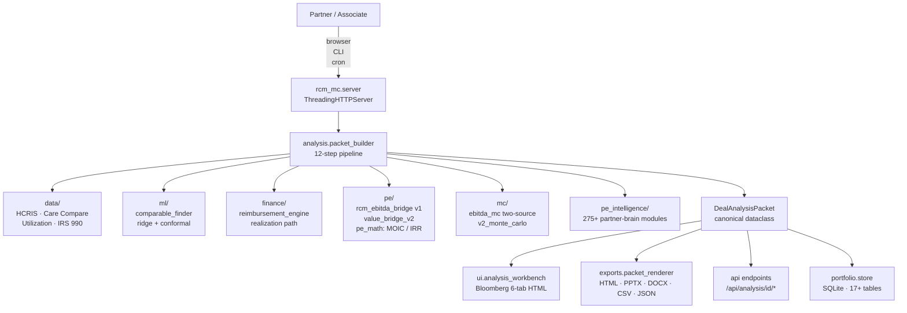

# SeekingChartis / RCM-MC

A healthcare private-equity diligence platform. Projects revenue-cycle
management (RCM) initiative outcomes on a deal, turns them into MOIC /
IRR / covenant math, and tracks the portfolio after close. Everything
renders from a single `DealAnalysisPacket` so the workbench, diligence
memo, LP update, and CSV export never disagree on a number.

Built on CPython 3.14 stdlib plus `numpy`, `pandas`, `pyyaml`,
`matplotlib`, and `openpyxl`. No `sklearn`, no Flask / FastAPI, no
Docker required for local use. Runs as a Python package plus a
stdlib `http.server.ThreadingHTTPServer`.

Status: 1,090 Python modules across 281 test files, 2,970+ passing
tests on the active `feature/pe-intelligence` branch.

---

## Table of contents

1. [What this is](#what-this-is)
2. [Architecture](#architecture)
3. [Capabilities by partner workflow](#capabilities-by-partner-workflow)
4. [Quick start](#quick-start)
5. [Project structure](#project-structure)
6. [Branches](#branches)
7. [Data sources](#data-sources)
8. [The math, in plain language](#the-math-in-plain-language)
9. [ML layer](#ml-layer)
10. [PE Intelligence brain](#pe-intelligence-brain)
11. [Public deals corpus](#public-deals-corpus)
12. [Sample outputs](#sample-outputs)
13. [Testing philosophy](#testing-philosophy)
14. [Roadmap](#roadmap)
15. [Contributing](#contributing)
16. [License](#license)
17. [Tech stack](#tech-stack)

---

## What this is

A partner reviewing a healthcare deal in IC needs three things in the
same hour:

1. **A sized, defensible bridge.** "If we take denial rate from 12%
   to 5%, A/R days from 55 to 38, and CMI up 0.05, what is the
   EBITDA delta? What enterprise value does that translate to at a
   12× exit?"
2. **An honest confidence interval.** Not a point estimate, but a
   distribution. What is the P10 / P50 / P90 MOIC under the
   two-source Monte Carlo (prediction uncertainty × execution
   uncertainty)?
3. **A partner's read.** Given the bridge, the confidence interval,
   and the packet's risk flags, what does a senior healthcare-PE
   partner actually say? Is there a named historical failure that
   rhymes with this deal? Is the thesis a site-of-service migration
   trap? A Medicare Advantage bridge trap? A denial-fix-in-12-months
   trap?

RCM-MC answers all three from the same packet. The
`DealAnalysisPacket` contains the observed metrics, predicted
missing metrics with conformal CIs, a v1 research-band bridge, a v2
unit-economics bridge, a Monte Carlo summary, risk flags, diligence
questions, a provenance graph, and a full PE-brain review. Every UI
page, API endpoint, and export renders from that one object.

## Architecture



Every arrow goes down. No layer imports from one below it. The
packet is the only shared object.

Full pipeline walk: [RCM_MC/docs/README_DATA_FLOW.md](RCM_MC/docs/README_DATA_FLOW.md).
Architecture deep-dive: [RCM_MC/docs/README_ARCHITECTURE.md](RCM_MC/docs/README_ARCHITECTURE.md).

## Capabilities by partner workflow

### Sourcing / early read

- **Public deals corpus** — 1,055+ publicly-disclosed hospital / DSO /
  behavioral / physician-services deals with EV, entry EBITDA, hold
  years, realized MOIC / IRR, payer mix. Backs base-rate queries,
  vintage cohort analytics, and corpus-calibrated pricing. See
  [rcm_mc/data_public/](RCM_MC/rcm_mc/data_public/).
- **On-face sniff test** — 400-bed rural CAH projecting 28% IRR, dental
  DSO at 4× revenue, MA-will-cover-FFS without a named contract: the
  brain calls it before the math. See
  [rcm_mc/pe_intelligence/unrealistic_on_face_check.py](RCM_MC/rcm_mc/pe_intelligence/unrealistic_on_face_check.py).
- **Archetype recognition** — maps teaser signals to one of seven
  healthcare thesis archetypes (payer-mix shift, back-office
  consolidation, outpatient migration, CMI uplift, roll-up platform,
  cost-basis compression, capacity expansion), with the right lever
  stack + named risks per archetype.

### Diligence / IC prep

- **12-step packet build** (`rcm_mc/analysis/packet_builder.py`) —
  load profile → observed metrics → completeness → comparables →
  ridge + conformal prediction → reimbursement + realization → v1
  bridge → v2 bridge → Monte Carlo → risk flags → provenance →
  diligence questions → final packet.
- **Bloomberg workbench** — single-file dark-theme HTML at
  `/analysis/<deal_id>`, six tabs (Overview / RCM Profile / EBITDA
  Bridge / Monte Carlo / Risk & Diligence / Provenance), interactive
  sliders on the bridge tab that debounce 300ms and POST custom
  targets.
- **Risk flags** — six categories (Operational / Regulatory / Payer /
  Coding / Data Quality / Financial) with CRITICAL / HIGH / MEDIUM /
  LOW severity. OBBBA / Medicaid work-requirement logic amplifies
  Medicaid-heavy deals in AR / GA / KY / NH / OH / UT / WI / IA / MT.
- **Diligence questions** — auto-generated P0 / P1 / P2 list that
  quotes the trigger number ("At 14.5% denial rate, please provide
  the root-cause breakdown…").
- **Provenance graph** — every number in the packet has upstream
  refs. `GET /api/analysis/<id>/explain/<metric_key>` returns plain
  English.

### PE math

- **v1 bridge** — research-band-calibrated 7-lever bridge
  ([rcm_mc/pe/rcm_ebitda_bridge.py](RCM_MC/rcm_mc/pe/rcm_ebitda_bridge.py)).
  Every coefficient sized against a $400M NPR Medicare-heavy
  reference; 29 regression tests lock the output bands.
- **v2 bridge** — unit-economics bridge
  ([rcm_mc/pe/value_bridge_v2.py](RCM_MC/rcm_mc/pe/value_bridge_v2.py))
  that reads the Prompt-2 reimbursement profile so a denial recovery
  is worth more on a commercial-heavy mix than a Medicare-heavy
  mix. Four flavors per lever: recurring revenue / recurring cost /
  one-time WC release / ongoing financing benefit. **EV multiple
  only applies to recurring EBITDA.** Cash release is reported
  separately.
- **Cross-lever dependency walk** — topological walk of the ontology
  DAG ([rcm_mc/pe/lever_dependency.py](RCM_MC/rcm_mc/pe/lever_dependency.py))
  so a denial-rate lever fired alongside its parent
  eligibility-denial lever doesn't double-count recovery.
- **Ramp curves** — per-lever S-curves
  ([rcm_mc/pe/ramp_curves.py](RCM_MC/rcm_mc/pe/ramp_curves.py)). Denial
  management 3–6 mo, AR/collections 2–4 mo, CDI/coding 6–12 mo, payer
  renegotiation 6–18 mo.
- **pe_math** — MOIC, IRR (bisection on non-integer holds), covenant
  headroom, hold-period sensitivity grid with P10/P50/P90 MOIC per
  cell.

### Monte Carlo

- **Two-source simulator** — prediction uncertainty (conformal CIs)
  × execution uncertainty (per-lever-family beta). Variance
  decomposition sums to 1.0 by construction; target-MOIC
  probabilities monotone by construction; zero-variance run
  reproduces the deterministic bridge to the penny (regression
  test).
- **v2 Monte Carlo** —
  [rcm_mc/mc/v2_monte_carlo.py](RCM_MC/rcm_mc/mc/v2_monte_carlo.py)
  samples four more honest dimensions: `collection_realization`,
  `denial_overturn_rate`, per-payer revenue leverage, exit multiple.
  Carries four distinct distributions: recurring EBITDA, one-time
  cash, EV-from-recurring, total cash to equity.
- **Scenario comparison** — base / upside / downside / management
  plan side-by-side. Pairwise win probability `P(A beats B)`. Picks
  recommended scenario via `mean − risk_aversion × downside_σ`.

### Portfolio operations

- **Alerts** lifecycle: fire → ack / snooze → history (age) →
  escalate → returning-badge when snooze expires.
- **Deals workflow** — owners, deadlines, tags, notes, watchlist,
  cohorts, health score with trend sparkline, rerun-simulation
  shortcut.
- **LP update** — one-click HTML at `/lp-update`, partner-ready.
- **Compare deals** — side-by-side + EBITDA trajectory SVG + JSON
  API.
- **Audit** — unified audit log, per-deal audit trail, CSRF, rate-
  limited login, scrypt passwords, FK-enforced cascades across 23
  child tables.

### PE Intelligence brain

- 275+ partner-reflex modules under
  [rcm_mc/pe_intelligence/](RCM_MC/rcm_mc/pe_intelligence/).
  Named-failure libraries, thesis-trap detectors, IC decision
  synthesizer, 3-year value-creation plan, earn-out advisor, WC peg
  negotiator, management forecast haircut, reverse diligence
  checklist, 100-day plan, bear case, partner-voice memo, RAC/OIG
  dollar exposure, 9 deal-smell detectors. See
  [RCM_MC/rcm_mc/pe_intelligence/README.md](RCM_MC/rcm_mc/pe_intelligence/README.md)
  for the full inventory.

## Quick start

```bash
git clone <this-repo> seekingchartis
cd seekingchartis/RCM_MC

# Install in editable mode (Python 3.10+ required; 3.14 tested).
python3 -m venv .venv
source .venv/bin/activate
pip install -e .

# Run the test suite (~2,970 tests on feature/pe-intelligence).
python -m pytest -q --ignore=tests/test_integration_e2e.py

# Seed a demo DB, start the server, open the browser.
python demo.py

# Or: create an admin and serve a real DB.
python -m rcm_mc.portfolio_cmd --db p.db users create \
  --username boss --password "Strong!1" --role admin
rcm-mc serve --db p.db --port 8080
```

CLI surface:

- `rcm-mc analysis <deal_id>` — build or load the packet.
- `rcm-mc data {refresh,status}` — CMS / IRS loaders.
- `rcm-mc portfolio register|list|...` — deal lifecycle.
- `rcm-mc pe override {set,list,clear}` — analyst overrides.
- `rcm-mc serve` — HTTP server.

Full CLI reference:
[RCM_MC/docs/README_API.md](RCM_MC/docs/README_API.md).

## Project structure

```
.
├── README.md                    ← this file
├── LICENSE
├── CONTRIBUTING.md
├── docs/                        ← cross-project docs (architecture, data, math, ml)
└── RCM_MC/                      ← the Python package + its own docs
    ├── pyproject.toml           ← package metadata, deps, console scripts
    ├── demo.py                  ← one-command local demo
    ├── CLAUDE.md                ← codebase conventions for contributors
    ├── docs/                    ← 30+ layer / feature deep-dives
    ├── tests/                   ← 281 test files, ~2,970 tests
    └── rcm_mc/
        ├── analysis/            packet dataclass + 12-step builder + cache
        ├── core/                simulator, kernel, distributions, calibration, RNG
        ├── data/                CMS + IRS + SEC loaders, intake, ingest
        ├── data_public/         1,055+ deal corpus + corpus analytics
        ├── deals/               deal CRUD, notes, tags, owners, deadlines
        ├── domain/              economic ontology, metric registry
        ├── exports/             packet_renderer (HTML/PPTX/DOCX/CSV/JSON)
        ├── finance/             reimbursement_engine, realization path
        ├── ml/                  25 files: ridge, conformal, comparables, ensemble
        ├── mc/                  two-source simulator, v2 MC, scenarios
        ├── pe/                  v1 + v2 bridges, pe_math, ramp_curves
        ├── pe_intelligence/     275+ partner-reflex modules
        ├── portfolio/           SQLite store (17+ tables), snapshots
        ├── provenance/          rich DAG + flat snapshot + explain
        ├── reports/             narrative, LP update, exit memo
        ├── scenarios/           scenario builder + shocks + overlay
        ├── ui/                  Bloomberg workbench + shared shell
        ├── server.py            stdlib ThreadingHTTPServer
        ├── cli.py               top-level CLI
        └── pe_cli.py            `rcm-mc pe` subcommands
```

## Branches

| Branch | Purpose |
|---|---|
| `main` | Stable baseline. 2,878 tests passing (per `RCM_MC/CLAUDE.md`). |
| `feature/pe-intelligence` | Active PE-partner-brain build. 275+ modules added, 2,970+ tests. Non-modification contract — only adds new files under `rcm_mc/pe_intelligence/`, `docs/PE_HEURISTICS.md`, and `tests/test_pe_intelligence.py`. Never touches the main codebase. |
| `feature/deals-corpus` | Prior work that added the public deals corpus infrastructure (merged into `main` historically; kept for reference). |
| `chore/public-readme` | This branch — adds the root README, license, contributor guide, and supporting docs. |

## Data sources

Every source below is wired up in code; nothing is aspirational. URLs
are the canonical public endpoints actually fetched by the loaders.

### CMS HCRIS (Hospital Cost Reports)

Loader: [RCM_MC/rcm_mc/data/cms_hcris.py](RCM_MC/rcm_mc/data/cms_hcris.py),
[RCM_MC/rcm_mc/data/hcris.py](RCM_MC/rcm_mc/data/hcris.py).

Portal: `https://data.cms.gov/provider-compliance/cost-report/hospital-provider-cost-report`.
The loader derives the annual zip URL via `HCRIS_URL_TEMPLATE`
(inherited from `hcris.py`). Parses into `HCRISRecord` with provider
ID, fiscal year, total revenue, operating expenses, uncompensated
care, bad debt. Loaded to the `hospital_benchmarks` SQLite table.

### CMS Care Compare

Loader: [RCM_MC/rcm_mc/data/cms_care_compare.py](RCM_MC/rcm_mc/data/cms_care_compare.py).

URLs (from `CARE_COMPARE_URLS`):
- General: `https://data.cms.gov/provider-data/api/1/datastore/query/xubh-q36u/0/download?format=csv`
- HCAHPS: `https://data.cms.gov/provider-data/api/1/datastore/query/632h-zaca/0/download?format=csv`
- Complications: `https://data.cms.gov/provider-data/api/1/datastore/query/ynj2-r877/0/download?format=csv`

Parses into `CareCompareRecord` (star rating, HCAHPS, readmissions,
mortality). One failing URL does not kill the batch.

### CMS Utilization (Medicare Inpatient)

Loader: [RCM_MC/rcm_mc/data/cms_utilization.py](RCM_MC/rcm_mc/data/cms_utilization.py).

URL (from `UTILIZATION_URL`):
`https://data.cms.gov/provider-summary-by-type-of-service/...`

IPPS DRG volumes per provider. Computes an HHI service-line
concentration score.

### IRS Form 990 (Non-Profit Hospitals)

Loader: [RCM_MC/rcm_mc/data/irs990_loader.py](RCM_MC/rcm_mc/data/irs990_loader.py).

Upstream API:
`https://projects.propublica.org/nonprofits/api/v2/search.json`

Wraps the ProPublica Nonprofit Explorer. Filters to NTEE codes E20 /
E21 / E22 (general hospital, specialty hospital, rehab / psych).
Extracts charity-care dollars, Medicare surplus, executive comp. Needs
a seeded `ein_list.json` for the hospital universe — refresh is
semi-manual.

### SEC EDGAR

Loader: [RCM_MC/rcm_mc/data/sec_edgar.py](RCM_MC/rcm_mc/data/sec_edgar.py).

Fetches revenue, margin, leverage from XBRL for ~25 public hospital
systems. Backs peer-valuation reads on public operators.

### Public deals corpus

`rcm_mc.data_public` — **1,055 publicly-disclosed deals** across 105
seed files (`deals_corpus.py` with 50 + `extended_seed_1.py` through
`extended_seed_104.py`). Source attribution on every row (SEC
filings, press releases, investor presentations, 10-Ks, Bloomberg
company profiles, Businesswire releases). Fields: deal name, buyer,
seller, year, EV ($M), entry EBITDA ($M), hold years, realized MOIC,
realized IRR, payer mix, notes. See the
[Public deals corpus](#public-deals-corpus) section below.

### Storage

All external benchmarks land in one table:

```sql
CREATE TABLE hospital_benchmarks (
    provider_id   TEXT,
    source        TEXT,     -- hcris / care_compare / utilization / irs990
    metric_key    TEXT,
    value         REAL,
    text_value    TEXT,
    period        TEXT,     -- e.g., "2023FY"
    loaded_at     TEXT,
    quality_flags TEXT,
    UNIQUE(provider_id, source, metric_key, period)
);
```

Orchestrated by
[RCM_MC/rcm_mc/data/data_refresh.py](RCM_MC/rcm_mc/data/data_refresh.py).
Status view via `rcm-mc data status`; triggered refresh via
`rcm-mc data refresh --source all`; HTTP view via
`GET /api/data/sources`. 28 tests cover the full surface.

Known weaknesses documented at
[RCM_MC/docs/README_LAYER_DATA.md](RCM_MC/docs/README_LAYER_DATA.md):
HCRIS refresh is semi-manual, IRS 990 requires a seeded ein list, Care
Compare schema drifts, Medicaid MCO distribution is not ingested, and
utilization skips OPPS.

## The math, in plain language

### The v1 EBITDA bridge

Given `current_metrics` and `target_metrics` on seven RCM levers, the
v1 bridge computes per-lever EBITDA impact and sums them:

$$
\Delta\text{EBITDA}_{\text{v1}} = \sum_{\ell \in \mathcal{L}}
f_\ell\bigl(m^{\text{cur}}_\ell, m^{\text{tgt}}_\ell,
\text{NPR}, \text{claims}, \ldots\bigr)
$$

where $\mathcal{L}$ is the seven-lever set (denial rate, days-in-AR,
clean-claim, net-collection, cost-to-collect, first-pass resolution,
CMI). Each $f_\ell$ is research-band-calibrated. Example — the
denial-rate lever:

$$
f_{\text{denial}} = \frac{\Delta_{\text{pp}}}{100} \cdot
\text{NPR} \cdot 0.35 \; + \; \text{rework}_{\text{saved}}
$$

The `0.35` is the sized avoidable share — not folklore, calibrated so
that a 12% → 5% reduction on a $400M NPR hospital lands in the
$8–15M band published in the research table.

Enterprise value:

$$
\Delta\text{EV}_{\text{v1}} = \Delta\text{EBITDA}_{\text{v1}} \cdot
m_{\text{exit}}
$$

where $m_{\text{exit}}$ is the exit multiple (10×/12×/15× reported
side-by-side).

### The v2 unit-economics bridge

v2 reads a `ReimbursementProfile` — an inferred exposure to the six
payer classes (Commercial / MA / Medicare FFS / Managed Government /
Medicaid / Self-pay) weighted by reimbursement method (FFS / DRG /
APC / Capitation / Cost-based / Bundled). A recovered denied claim is
worth:

$$
\text{recovery}_{p} = \text{claim}_p \cdot w_p,\quad
w_p = \begin{cases}
1.00 & p = \text{Commercial} \\
0.80 & p = \text{MA} \\
0.75 & p = \text{Medicare FFS} \\
0.55 & p = \text{Managed Gov} \\
0.50 & p = \text{Medicaid} \\
0.40 & p = \text{Self-pay}
\end{cases}
$$

(`_PAYER_REVENUE_LEVERAGE` in
[value_bridge_v2.py](RCM_MC/rcm_mc/pe/value_bridge_v2.py).) This is
the mechanism that makes commercial-heavy denial recovery worth more
than Medicare-heavy recovery — the v1 bridge cannot express this
because it applies a uniform coefficient.

Each lever produces four **separate** flows:

$$
\text{LeverImpact} = \{r_{\text{rev}}, r_{\text{cost}},
c_{\text{wc}}, r_{\text{fin}}\}
$$

Recurring EBITDA delta:

$$
\Delta\text{EBITDA}^{\text{rec}}_\ell = r_{\text{rev},\ell} +
r_{\text{cost},\ell} + r_{\text{fin},\ell}
$$

Enterprise value from **recurring only** (the load-bearing
invariant — cash release never inflates EV):

$$
\Delta\text{EV}_{\text{v2}} = \biggl(\sum_\ell
\Delta\text{EBITDA}^{\text{rec}}_\ell \biggr) \cdot m_{\text{exit}}
$$

$c_{\text{wc}}$ (one-time working-capital release) is reported
side-by-side but never multiplied.

### Cross-lever dependency adjustment

When $\ell_{\text{child}}$ is a causal child of $\ell_{\text{parent}}$
in the ontology DAG, firing both would double-count revenue recovery.
The dependency walk reduces the child's revenue component:

$$
r^{\text{adj}}_{\text{rev},\text{child}} = r_{\text{rev},\text{child}}
\cdot \bigl(1 - \min\bigl(0.75,\; \Sigma\,\alpha_{\text{hint}}\bigr)\bigr)
$$

where $\alpha_{\text{hint}} \in \{0.60, 0.35, 0.15\}$ for
magnitude hints "strong" / "moderate" / "weak" respectively, and
0.75 is the safety cap (`_MAX_TOTAL_OVERLAP`). Only the revenue flow
is reduced — cost savings, WC release, and financing benefit are
independent pathways. Adjustments only shrink, never inflate.

### Ramp curves

A single-scalar implementation ramp overstates Year 1 and understates
Year 3. Per-lever-family S-curves:

$$
\text{ramp}(t) = \frac{1}{1 + e^{-k(t - t_{50})}}, \quad
\text{clipped to }[0, 1]
$$

with $t_{25}$, $t_{75}$, $t_{\text{full}}$ from
`DEFAULT_RAMP_CURVES`. Denial management hits 25% / 75% / 100% at
3 / 6 / 12 months; payer renegotiation at 6 / 12 / 24 months.
At `evaluation_month = 36` every default curve returns 1.0 (identity
lock by test).

### Two-source Monte Carlo

For each simulation $i \in \{1, \ldots, N\}$:

1. **Prediction draw.** $\tilde{m}^{\text{tgt}}_{\ell,i} \sim
   \mathcal{N}(m^{\text{tgt}}_\ell, \sigma_\ell)$
   where $\sigma_\ell = (\text{ci}_{\text{high}} - \text{ci}_{\text{low}})
   / (2 \cdot 1.645)$ (90% conformal CI).
2. **Execution draw.** $e_{\ell,i} \sim
   \text{Beta}(\alpha_{\text{fam}(\ell)}, \beta_{\text{fam}(\ell)})$
   where the family shape is:
   - Denial management: Beta(7,3) → E[e] = 0.70
   - AR/collections: Beta(8,2) → E[e] = 0.80
   - CDI/coding: Beta(6,4) → E[e] = 0.60
   - Payer renegotiation: Beta(5,5) → E[e] = 0.50
3. **Final value.** $m^{\text{final}}_{\ell,i} = m^{\text{cur}}_\ell +
   (\tilde{m}^{\text{tgt}}_{\ell,i} - m^{\text{cur}}_\ell) \cdot e_{\ell,i}$.
4. **Bridge.** $\text{EBITDA}_i = \text{bridge}(m^{\text{cur}},
   m^{\text{final}}_i)$.

Aggregate across $N$ simulations → `DistributionSummary`
(P5 / P10 / P25 / P50 / P75 / P90 / P95 / mean / std). Default
$N = 2{,}000$; the vectorized path supports $N = 100{,}000$ in under
a second.

**Variance attribution** — normalized correlation-squared between
each lever's sample column and the EBITDA output, summing to 1.0 by
construction (first-order Sobol-style).

### Prediction intervals (split conformal)

On a held-out calibration set $\{(x_j, y_j)\}_{j=1}^n$ with fitted
base model $\hat{f}$:

$$
R_j = |y_j - \hat{f}(x_j)|, \quad
q = R_{(\lceil (1-\alpha)(n+1) \rceil)}
$$

Then for any new $x^*$:

$$
\Pr\bigl[y^* \in [\hat{f}(x^*) - q,\; \hat{f}(x^*) + q]\bigr] \geq 1 - \alpha
$$

with **no distributional assumption** — only exchangeability between
the calibration set and the test point. Implementation in
[rcm_mc/ml/conformal.py](RCM_MC/rcm_mc/ml/conformal.py), ~230 lines
of numpy. Empirical coverage on 1,000 simulated held-out samples:
85–96% for a nominal 90% target, tested at
`test_ridge_predictor.py::test_coverage_property_on_simulated_data`.

More math: [docs/MATH.md](docs/MATH.md).

## ML layer

Two jobs: (1) find comparable hospitals for a target, and (2) use
those comparables to predict missing RCM metrics with honest
uncertainty intervals. No `sklearn` — Ridge is one closed-form
numpy block, conformal is ~50 lines.

### Comparable finder

[rcm_mc/ml/comparable_finder.py](RCM_MC/rcm_mc/ml/comparable_finder.py).
Weighted 6-dimension similarity:

| Dimension | Weight | Similarity |
|---|---|---|
| Bed count | 0.25 | $1 - \|a - b\|/\max(a, b)$ |
| Region | 0.20 | 1.0 match / 0.0 else |
| Payer mix | 0.25 | cosine on payer vectors |
| System affiliation | 0.10 | 1.0 match / 0.0 else |
| Teaching status | 0.10 | 1.0 match / 0.0 else |
| Urban/rural | 0.10 | 1.0 match / 0.0 else |

Missing dimension → 0.5 (neutral), not NaN.

### Size-gated fallback ladder

[rcm_mc/ml/ridge_predictor.py](RCM_MC/rcm_mc/ml/ridge_predictor.py).
For each missing metric, cohort size decides the method:

| Cohort size | Method | CI basis | Grade |
|---|---|---|---|
| ≥ 15 peers with metric | Ridge + split conformal (70/30) | conformal $q$ margin | A if n≥30, R²≥0.60 |
| 5–14 peers | Weighted median + bootstrap | 1,000 resamples, symmetric percentiles | B if n≥10 else C |
| < 5 peers | Benchmark P50 | P25–P75 as band | D always |

Dollar-valued metrics (`net_revenue`, `gross_revenue`,
`current_ebitda`, `total_operating_expenses`) are **never** predicted
— they are partner inputs. The model never fabricates EBITDA from
comparable medians.

### Feature engineering

[rcm_mc/ml/feature_engineering.py](RCM_MC/rcm_mc/ml/feature_engineering.py).
Interaction terms per target metric:
`denial_to_collection_ratio`, `ar_efficiency`, `first_pass_gap`,
`avoidable_denial_burden`, `payer_complexity_score`
($0.4 \cdot \text{commercial\_pct} + 0.35 \cdot \text{medicaid\_pct}
+ 0.25 \cdot \text{MA\_pct}$), `revenue_per_bed`. Z-scored against
benchmark statistics.

### Backtester

[rcm_mc/ml/backtester.py](RCM_MC/rcm_mc/ml/backtester.py). Two modes:

- Legacy LOO — mask each hospital's metrics, predict from the rest,
  score MAE / R² / MAPE per metric.
- Conformal coverage — hide `holdout_fraction` of a hospital's
  metrics, predict, check whether the truth landed in the 90% CI.
  **Coverage rate is the critical signal:** < 85% means the conformal
  calibration is broken.

### Ensemble + anomaly + temporal

- `ensemble_predictor.py` — Ridge / k-NN / weighted-median picker,
  chooses per metric by held-out MAE.
- `anomaly_detector.py` — three strategies (z-score, causal
  consistency via ontology, temporal discontinuity).
- `temporal_forecaster.py` — linear OLS (≥6 periods), Holt-Winters
  (≥8 + seasonality), or weighted-recent.
- `portfolio_learning.py` — cross-deal bias shrinkage.

Deep dive: [docs/ML.md](docs/ML.md) and
[RCM_MC/docs/README_LAYER_ML.md](RCM_MC/docs/README_LAYER_ML.md).

## PE Intelligence brain

Under [rcm_mc/pe_intelligence/](RCM_MC/rcm_mc/pe_intelligence/) sits a
library of **275+ partner-reflex modules** — the judgment layer that
turns a packet into a partner's read.

Organized around seven reflexes:

1. **Sniff test before math** — on-face checks on IRR, EV/revenue,
   projected margin, MA bridges without named contracts.
2. **Archetype on sight** — payer-mix shift / back-office /
   outpatient migration / CMI uplift / roll-up / cost compression /
   capacity.
3. **Named-failure pattern match** — fingerprint matching against
   dated historical failures (MA unwind 2023, NSA platform rate shock
   2022, PDGM 2020, Envision / KKR post-NSA, etc.) with specific
   lessons.
4. **Dot-connect** — traces packet signals through causal chains
   (denial fix → CMI reversal → Medicare bridge impact).
5. **Recurring vs one-time discipline** — at the line-item level.
6. **Regulatory $-impact** — OBBBA / site-neutral / sequestration /
   state Medicaid / PAMA translated into service-line dollar
   exposure.
7. **Partner voice** — willing to say pass when the math doesn't
   work.

Highlights from the inventory:

- **Four canonical cascades** — payer-mix shift, back-office, CMI
  uplift, roll-up.
- **IC decision synthesizer** — one page: "recommend / pass / price
  X", with the three numbers behind the call.
- **3-year value-creation plan** — quarter-by-quarter lever
  sequencing with dependency-aware ordering.
- **Exit readiness** — buyer-type fit matrix, add-on fit matrix,
  exit-story generator, cycle-timing pricing check.
- **6-dimension concentration scan** — payer, geography, service
  line, physician, system, referral source.
- **Post-close surprises** — miss-rate learning loop, regional wage
  inflation overlay, RAC/OIG dollar exposure, IRR decay curve.
- **Deal process** — competing deals ranker, banker-reply letter,
  synergy credibility scorer, process stopwatch.
- **Debt + financing** — debt capacity sizer, covenant headroom,
  earn-out design advisor, rollover equity designer.
- **Pre-sale prep** — reverse diligence checklist, management
  forecast reliability (haircut rec), WC peg negotiator, 100-day
  plan.
- **Regulatory calendar 2026–2028** — OBBBA phase-in, 340B rule
  changes, MA risk-adjustment revisions.
- **9 deal-smell detectors** — rapid pre-math red-flag scans.

Full inventory + entry points:
[RCM_MC/rcm_mc/pe_intelligence/README.md](RCM_MC/rcm_mc/pe_intelligence/README.md).

The brain follows a strict non-modification contract: it only
writes to `rcm_mc/pe_intelligence/`, `docs/PE_HEURISTICS.md`, and
`tests/test_pe_intelligence.py`. Nothing else on `main` is touched.

## Public deals corpus

[rcm_mc/data_public/deals_corpus.py](RCM_MC/rcm_mc/data_public/deals_corpus.py)
+ 104 `extended_seed_N.py` files → **1,055 publicly-disclosed
hospital / health-system / DSO / behavioral / physician-services
deals** backing base-rate queries, vintage cohort analytics, and
corpus-calibrated pricing.

### Schema

```sql
CREATE TABLE public_deals (
    deal_id            INTEGER PRIMARY KEY AUTOINCREMENT,
    source_id          TEXT NOT NULL,
    source             TEXT NOT NULL DEFAULT 'seed',
    deal_name          TEXT NOT NULL,
    year               INTEGER,
    buyer              TEXT,
    seller             TEXT,
    ev_mm              REAL,
    ebitda_at_entry_mm REAL,
    hold_years         REAL,
    realized_moic      REAL,
    realized_irr       REAL,
    payer_mix          TEXT,    -- JSON
    notes              TEXT,
    ingested_at        TEXT NOT NULL,
    UNIQUE(source_id)
);
```

### Coverage

- **Subsectors** — acute hospitals, LTACH / rehab, behavioral health
  (residential + outpatient + SUD), physician staffing (EM /
  anesthesia / hospitalist), dental DSOs, dermatology DSOs,
  ophthalmology platforms, orthopedics, radiology, urgent care,
  dialysis, home health, hospice, SNF, senior living, ASCs,
  physician practices, HCIT, MSO / IPA.
- **Vintage years** — 2004 to 2024-present.
- **Sponsor types** — mega-buyout (KKR, Bain, Blackstone, TPG,
  Carlyle, Apollo, Advent), upper-middle (Warburg, Welsh Carson,
  New Mountain, Silver Lake), middle-market (Audax, Thomas H. Lee,
  Genstar, Madison Dearborn, GTCR), plus strategic acquirers
  (UHS, Tenet, HCA, CVS / Aetna, Optum, Humana).
- **Dispositions** — realized MOIC / IRR when publicly disclosed;
  `None` where the deal is still held or the sponsor never
  reported. Canonical cautionary deals are in the corpus (Envision /
  KKR, Steward Health Care, Surgery Partners vintages).

### Analytics on top of the corpus

Under [rcm_mc/data_public/](RCM_MC/rcm_mc/data_public/):
`base_rates.py`, `comparables.py`, `vintage_analysis.py`,
`vintage_cohorts.py`, `peer_transactions.py`, `peer_valuation.py`,
`subsector_benchmarks.py`, `sector_correlation.py`,
`sponsor_track_record.py`, `sponsor_heatmap.py`, `deal_teardown_analyzer.py`,
`corpus_red_flags.py`, `corpus_vintage_risk_model.py`,
`corpus_health_check.py`, `corpus_report.py`, `corpus_export.py`.

Every value flows through the same `DealsCorpus` loader so the
provenance is one function call away.

## Sample outputs

### Ridge + conformal prediction

```python
from rcm_mc.ml.ridge_predictor import predict_missing_metrics

preds = predict_missing_metrics(
    known_metrics={"days_in_ar": 55.0, "cost_to_collect": 4.0},
    comparables=peer_pool,             # 50 dicts from find_comparables
    metric_registry=RCM_METRIC_REGISTRY,
    coverage=0.90,
    seed=42,
)

preds["denial_rate"]
# PredictedMetric(
#     value=10.8,
#     method="ridge_regression",
#     ci_low=7.9, ci_high=13.7,     # 90% conformal CI
#     coverage_target=0.90,
#     n_comparables_used=42,
#     r_squared=0.58,
#     feature_importances={"ar_efficiency": 0.34, "payer_complexity_score": 0.28, ...},
#     reliability_grade="B",
# )
```

### v2 bridge

```python
from rcm_mc.pe.value_bridge_v2 import compute_value_bridge, BridgeAssumptions

result = compute_value_bridge(
    current_metrics={"denial_rate": 12.0, "days_in_ar": 55.0,
                     "cost_to_collect": 4.0, "case_mix_index": 1.72},
    target_metrics ={"denial_rate":  5.0, "days_in_ar": 38.0,
                     "cost_to_collect": 3.0, "case_mix_index": 1.77},
    reimbursement_profile=profile,     # from reimbursement_engine
    assumptions=BridgeAssumptions(exit_multiple=12.0, evaluation_month=36),
    realization=realization,           # from reimbursement_engine
    current_ebitda=45.0,
)
# ValueBridgeResult(
#     total_recurring_ebitda_delta = 22.4,     # $M/yr
#     total_one_time_wc_release    =  8.7,     # $M, never capitalized
#     enterprise_value_from_recurring = 268.8, # $M at 12x
#     cash_release_excluded_from_ev   =   8.7, # side-by-side
#     rationale = "denial_rate dominates (+$9.8M/yr recurring revenue);
#                  days_in_ar mostly WC; CMI constrained by DRG share",
#     status = "OK",
# )
```

### Two-source Monte Carlo

```python
from rcm_mc.mc.ebitda_mc import RCMMonteCarloSimulator, from_conformal_prediction

sim = RCMMonteCarloSimulator(bridge, n_simulations=10_000, seed=42)
sim.configure(
    current_metrics=current,
    metric_assumptions={
        "denial_rate": from_conformal_prediction(
            "denial_rate", current=12.0, target=5.0, ci_low=4.1, ci_high=5.9),
        # ...
    },
    entry_multiple=10.0, exit_multiple=12.0, hold_years=5.0,
    moic_targets=[1.5, 2.0, 2.5, 3.0],
    covenant_leverage_threshold=6.0,
)
result = sim.run()
# MonteCarloResult(
#     ebitda_summary          = DistributionSummary(p10=14.2, p50=21.1, p90=29.8, mean=21.4, std=6.1),
#     moic_summary            = DistributionSummary(p10=1.82, p50=2.35, p90=2.96, ...),
#     irr_summary             = DistributionSummary(...),
#     probability_of_target_moic = {"1.5x": 0.94, "2x": 0.71, "2.5x": 0.38, "3x": 0.11},
#     probability_of_covenant_breach = 0.03,
#     variance_contribution   = {"denial_rate": 0.41, "days_in_ar": 0.26, ...},  # sums to 1.0
#     convergence_check       = ConvergenceReport(converged=True, ...),
# )
```

## Testing philosophy

From [RCM_MC/CLAUDE.md](RCM_MC/CLAUDE.md) and
[RCM_MC/docs/README_BUILD_STATUS.md](RCM_MC/docs/README_BUILD_STATUS.md):

- **No mocks of our own code.** Exercise the real path. `unittest.mock`
  is acceptable only for external stubs (a failing `log_event` to
  verify silent-failure handling).
- **Multi-step workflows are tested end-to-end** via a real HTTP
  server on a free port, using `urllib.request`.
- **Order-independent tests.** Class-level state reset in
  `setUp` / `tearDown`.
- **Regression tests lock economic invariants.** The v1 bridge has
  29 tests that lock the research-band output for a $400M NPR
  reference hospital. The v2 bridge has 25 tests locking the 10
  economic spec invariants (commercial > Medicare denial value,
  DRG-heavy CMI > commercial CMI, self-pay amplifies bad-debt,
  capitation dampens denials, days-in-AR → WC dominant,
  cost-to-collect → pure cost, net-collection-rate → pure revenue,
  EV scales with recurring only, implementation-ramp scales
  cleanly, provenance on every lever).
- **Conformal coverage is empirically verified.** On 1,000 simulated
  samples, 90% intervals cover 85–96% of truth
  (`test_ridge_predictor.py::test_coverage_property_on_simulated_data`).
- **Zero-variance Monte Carlo identity lock.** When all uncertainty
  sources collapse to their means, MC P50 reproduces the
  deterministic bridge to the penny.
- **Packet reproducibility lock.**
  `tests/test_packet_reproducibility.py` — identical `hash_inputs`
  → identical packet content across builds.

Run:

```bash
cd RCM_MC
python -m pytest -q --ignore=tests/test_integration_e2e.py
```

Current: 2,970+ tests on `feature/pe-intelligence`, 2,878 on `main`.

## Roadmap

From [RCM_MC/docs/README_BUILD_STATUS.md](RCM_MC/docs/README_BUILD_STATUS.md):

### Tier 1 — economic realism

- Per-payer revenue leverage overrides per market (currently static
  industry-folklore).
- Per-payer × denial-category appeal-recovery rate (currently
  single scalar 0.39).
- HCC risk-adjustment path under capitation.
- Medicaid MCO detail (currently collapses into `MANAGED_GOVERNMENT`).

### Tier 2 — product polish

- Scheduled LP-update email delivery.
- Structured per-request logging with request-id threading.
- Retire the back-compat aliases for `ReimbursementProfile` and
  `ProvenanceGraph` once all internal callers migrate.
- Session-token + CSRF survival across server restart (sessions are
  persisted; form tokens are still per-process).

### Tier 3 — deep infrastructure

- Cached-packet invalidation on ontology version bump.
- Optional xlsx export (openpyxl already in base deps).

### PE Intelligence branch

- Continues the partner-brain build. Module count climbs; test
  count grows in lockstep. Non-modification contract keeps the
  main codebase untouched.

## Contributing

See [CONTRIBUTING.md](CONTRIBUTING.md).

The non-negotiables:

1. **No new runtime dependencies** without discussion.
2. **Parameterized SQL only** — never f-string values into SQL.
3. **`BEGIN IMMEDIATE`** around check-then-write sequences in
   SQLite.
4. **`html.escape()` every user string** before rendering to HTML.
5. **`_clamp_int` every integer query parameter.**
6. **Tests before ship.** Each new feature gets a
   `test_<feature>.py`. Bug fixes get `test_bug_fixes_b<N>.py` with
   a regression assertion.
7. **Docstrings explain *why*, not *what*.** The code says what; the
   docstring explains the constraint or the prior incident that
   drove the decision.
8. **Additive dataclass changes only.** Every new field gets a
   sensible default so old packets still round-trip.

The feature-branch workflow:

- `main` is the stable baseline.
- New work lives on a `feature/*` or `chore/*` branch.
- PRs merge to `main` only after the full test suite passes
  (`python -m pytest -q --ignore=tests/test_integration_e2e.py`).
- `feature/pe-intelligence` operates under a non-modification
  contract — it only *adds* files under `rcm_mc/pe_intelligence/`,
  `docs/PE_HEURISTICS.md`, and `tests/test_pe_intelligence.py`.
  Nothing else is touched.

## License

MIT. See [LICENSE](LICENSE).

(The `RCM_MC/pyproject.toml` metadata still reads `Proprietary` from
the project's earlier phase; the repository itself is MIT-licensed
as of this branch. The pyproject field will be updated in a follow-up.)

## Tech stack

| Layer | Technology | Notes |
|---|---|---|
| Language | CPython 3.14 (3.10+ supported) | stdlib-heavy |
| HTTP | `http.server.ThreadingHTTPServer` | no Flask / FastAPI |
| DB | `sqlite3` stdlib | 17+ tables, `busy_timeout=5000`, idempotent `CREATE TABLE IF NOT EXISTS` |
| Auth | `hashlib.scrypt` + session cookies | no third-party IdP |
| ML | `numpy` closed-form Ridge + conformal | no `sklearn` |
| Numerics | `numpy`, `pandas` | — |
| Plots | `matplotlib` (server-side SVG) | — |
| Excel | `openpyxl` | base dep |
| Config | `pyyaml` | — |
| CLI | `argparse` | `rcm-mc` console script |
| Tests | stdlib `unittest` driven by `pytest` | — |
| Optional | `python-pptx`, `python-docx`, `plotly` | graceful fallback when absent |

Zero new runtime dependencies have been added in any recent work.
The dependency surface is small on purpose: auditable, portable, and
small enough for a partner-driven laptop deploy.

---

**Navigating further:**

- [RCM_MC/README.md](RCM_MC/README.md) — package-level README.
- [RCM_MC/CLAUDE.md](RCM_MC/CLAUDE.md) — codebase conventions.
- [RCM_MC/docs/README_INDEX.md](RCM_MC/docs/README_INDEX.md) — full docs
  index (architecture, data flow, every layer, glossary, API, build
  status, analysis packet schema).
- [RCM_MC/docs/PE_HEURISTICS.md](RCM_MC/docs/PE_HEURISTICS.md) —
  partner-rule catalog.
- [RCM_MC/rcm_mc/pe_intelligence/README.md](RCM_MC/rcm_mc/pe_intelligence/README.md)
  — PE brain module inventory.
- [docs/ARCHITECTURE.md](docs/ARCHITECTURE.md),
  [docs/DATA_SOURCES.md](docs/DATA_SOURCES.md),
  [docs/MATH.md](docs/MATH.md),
  [docs/ML.md](docs/ML.md) — standalone topic summaries for
  public readers.
