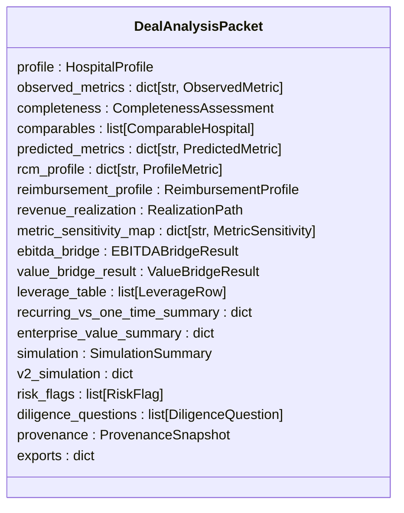
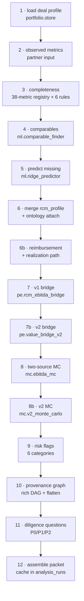
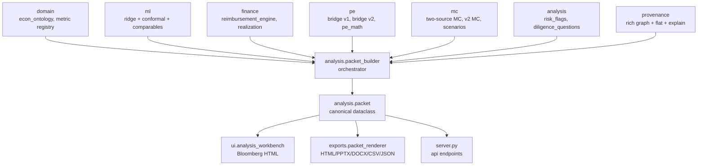
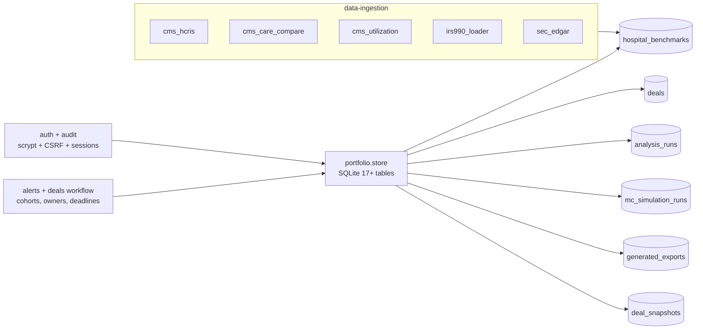

# Architecture

This document is a standalone read for public contributors. For the
in-repo reference with file-level detail see
[`RCM_MC/docs/README_ARCHITECTURE.md`](../RCM_MC/docs/README_ARCHITECTURE.md).

## The one invariant

> Every UI page, every API endpoint, and every export renders from a
> single `DealAnalysisPacket` instance. Nothing renders independently.

If the Bloomberg workbench and the diligence memo disagree on a
number, that's a renderer bug — not a data bug. This is the
load-bearing design commitment that makes outputs audit-defensible.

## The packet

A `DealAnalysisPacket` is a large dataclass (~19 sections)
containing everything known about one deal. Defined in
[`rcm_mc/analysis/packet.py`](../RCM_MC/rcm_mc/analysis/packet.py).

Full schema: [`RCM_MC/docs/ANALYSIS_PACKET.md`](../RCM_MC/docs/ANALYSIS_PACKET.md).

## The 12-step build pipeline

`rcm_mc.analysis.packet_builder.build_analysis_packet()` walks
through 12 sequential steps. Each step is wrapped so a failure in
one section doesn't kill the packet — that section gets
`status=FAILED` with a reason and downstream steps continue.

## Cross-layer dependency graph

Rule: every arrow goes **down**. A layer may never import from a
layer below that circles back. This keeps the whole system
intelligible as it grows.

## Caching

Every build writes one row to `analysis_runs`:

- `deal_id`
- `hash_inputs` — SHA256 of `(deal_id, observed_metrics, scenario_id,
  as_of, profile)` with `sort_keys=True`
- compressed JSON blob of the full packet

`get_or_build_packet()` checks the cache by
`(deal_id, hash_inputs)` before building — identical inputs return
the exact cached packet. `force_rebuild=True` bypasses the cache.

This is why the reproducibility contract works: identical inputs →
identical packet content (locked by
`tests/test_packet_reproducibility.py`).

## Supporting infrastructure

## Tech-stack invariants

- **Python 3.14** stdlib-heavy (3.10+ supported).
- Runtime deps: `numpy`, `pandas`, `pyyaml`, `matplotlib`,
  `openpyxl`. Optional: `python-pptx`, `python-docx`, `plotly`,
  `scipy` with graceful fallbacks.
- **No `sklearn`.** Ridge + conformal implemented in numpy
  closed-form (~300 lines).
- **No Flask / FastAPI.** Stdlib `http.server.ThreadingHTTPServer`.
- **SQLite** via stdlib `sqlite3`. Every table uses
  `CREATE TABLE IF NOT EXISTS` for idempotent migrations.
- **Auth** via stdlib `hashlib.scrypt` + session cookies.
- **Tests** via stdlib `unittest`, driven by `pytest`.
